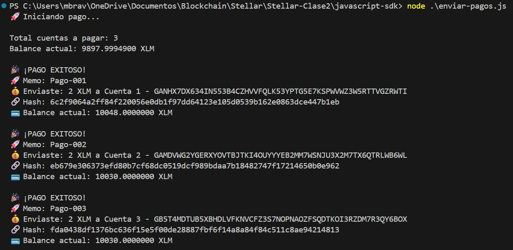
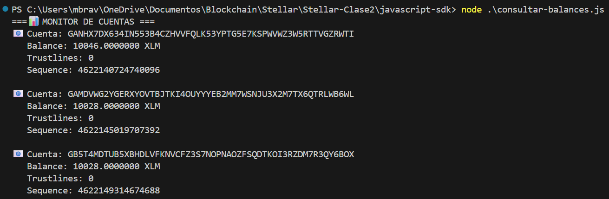

🌟 ## **Stellar SDK Scripts - CLASS 2**

This repository contains a collection of JavaScript scripts for interacting with the Stellar Testnet using the @stellar/stellar-sdk package. It includes functionality for creating accounts, funding them, sending payments, and checking balances.

📁 ## **Project Structure**
```bash 
.
├── hello-contract
├── javascript-sdk
│   ├── crear-cuentas.js        # Generates new accounts and funds them via Friendbot
│   ├── enviar-pagos.js         # Sends payments from a source account to multiple destinations
│   ├── consultar-balances.js   # Checks balances, trustlines, and sequence numbers of accounts
│   ├── accounts.json           # JSON file generated with created account data
│   ├── package-lock.json           # JSON file generated with created account data
│   ├── package.json           # JSON file generated with created account data
├── stellar-cli
├── readme.md
```

🚀 ## **Requirements**

Node.js (v18 or higher recommended)
Internet connection (to interact with Horizon and Friendbot)
Stellar SDK: install with ```bash npm install @stellar/stellar-sdk```

🛠️ ## **Available Scripts**

1. **crear-cuenta.js**

Generates multiple random Stellar accounts receiving the number of accounts desired in accounts variable. Then it funds them using Friendbot, and saves their keys and balances to a accounts.json file. 

Run: ```node crear-cuentas.js```

Expected output:
* Public and secret keys
* Funding transaction hash
* Initial balance
* accounts.json file with account data


2. **enviar-pagos.js**

Sends XLM payments from a source account to a list of recipients defined in the DESTINATIONS array.

Before running:
Make sure SECRET_KEY contains the secret key of a funded source account and DESTINATIONS contains the public keys, memo and amount to be transfered.

Run: ```node enviar-pagos.js```

Features:
* Verifies balance before each payment
* Stops execution if an error occurs in any of the payments
* Displays transaction hash and updated recipient balance



3. **consultar-balances.js**

Checks balances, trustlines, and sequence numbers for a list of accounts.

Run: ```node consultar-balances.js```

Expected output:
* XLM balance
* Non-native assets (if any)
* Number of trustlines
* Account sequence number



📦 ## **Additional Notes**
* All scripts use the Stellar Testnet.
* Get free XLM for testing from Friendbot
* Trustlines allow an account to hold non-XLM assets. These are automatically counted in consultar-balances.js.